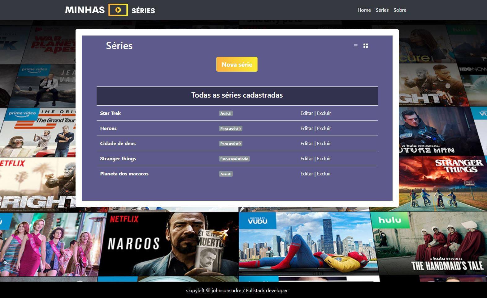
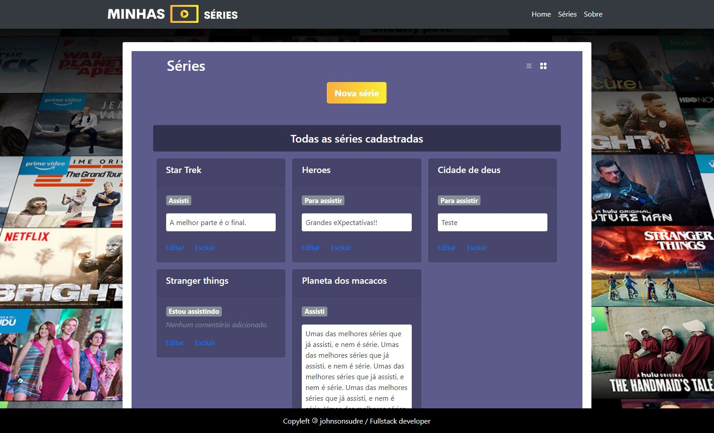

<h4 align="center" style="margin:0;"><i>Cadastro de séries e comentários</h3>
<h5 align="center" style="margin:0; margin-bottom: 25px">com nodejs, ejs, nosql db, bootstrap</h5>
</i>

|     | <p> . [About](#about) . [Folder Structures](#folder-structures) . [Libraries & Frameworks](#libraries-frameworks) . [Installation & Set Up](#installation-setup) . [Licence](#licence) . </p> |     |
| --- | :-------------------------------------------------------------------------------------------------------------------------------------------------------------------------------------------: | --: |

#### 1. About

This project implement a small crud created with nodejs, express and mongodb with mongoose ORM.







#### 2. Folder Structures

```bash
+--- controllers
+--- models
+--- public
+--- public
     +--- css
     +--- images
     +--- js
     +--- vendor
+--- routes
+--- views
     +--- partials
     +--- series
```

##

#### 3. Dev Libraries & Frameworks

| Name                                                    | Description                                                                                                        |
| ------------------------------------------------------- | ------------------------------------------------------------------------------------------------------------------ |
| [Node.js](https://nodejs.org/) | Node.js is an open source platform that allows the execution of javascript code at the frontend and backend level. |
| [Express.js](https://expressjs.com/pt-br/) | Express.js is a framework for Node.js that provides minimal resources for building web servers. |
| [Mongoose](https://mongoosejs.com/) | Mongoose provides a straight-forward, schema-based solution to model your application data. |
| [NoSQLBooster](https://nosqlbooster.com/) | NoSQLBooster for MongoDB is a shell-centric cross-platform GUI tool for MongoDB. |
| [ejs](https://ejs.co/) | EJS is a simple templating language that lets you generate HTML markup with plain JavaScript.    |

##

#### 4. Installation & Set Up

##### a) Download & unpack project files

##### b) Install project dependencies

```bash
  npm install or yarn install
```
##### c) Download, install and run [NoSQLBooster](https://nosqlbooster.com/downloads)

##### d) Start project

```bash
  node index.js
```
#### 4. License

MIT © [Johnson Sudré](https://github.com/johnsonsudre)